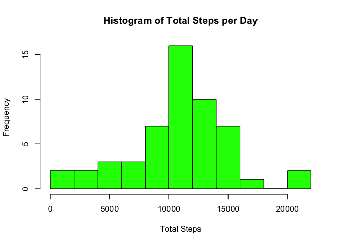
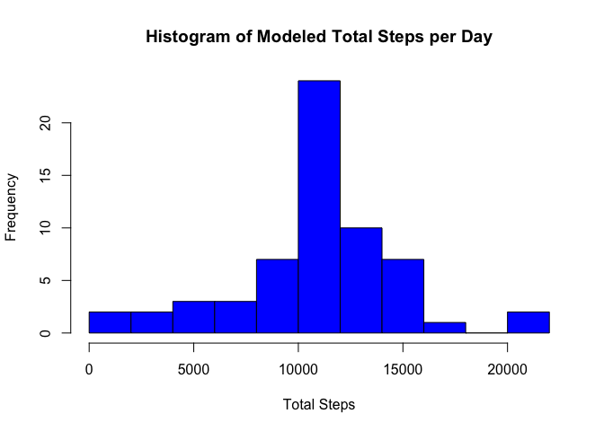

# Reproducible Research: Peer Assessment 1


## Loading and preprocessing the data

*1. Load the data (i.e. `read.csv()`).*

*2. Process/transform the data (if necessary) into a format suitable for your analysis.*

The data is already present in the forked working directory, so we do not need to download the data. However, it is zipped, so it needs to be extracted and then we must see what the condition of the data is.


```r
unzip('activity.zip')
activity <- read.csv('activity.csv')
str(activity)
```

```
## 'data.frame':	17568 obs. of  3 variables:
##  $ steps   : int  NA NA NA NA NA NA NA NA NA NA ...
##  $ date    : Factor w/ 61 levels "2012-10-01","2012-10-02",..: 1 1 1 1 1 1 1 1 1 1 ...
##  $ interval: int  0 5 10 15 20 25 30 35 40 45 ...
```

We now have a readable dataframe. Later, we will need to strip NAs, convert the date format, etc. Additional manipulation and transformation will be performed inline below to meet the needs of each analysis.

## What is mean total number of steps taken per day?

*1. Make a histogram of the total number of steps taken each day.*

Here is a histogram showing the total number of steps taken each day. To produce this histogram I created a new dataframe aggregating the total number of steps per day. I've increased the number of bins to increase the granularity of the histogram:


```r
## This dataframe consolidates all steps by date.

activityperday <- na.omit(
        aggregate(activity$steps, 
                  by=list(activity$date), 
                  FUN=sum))
colnames(activityperday) <- c('date', 'steps')

## Here is the histogram.

hist(activityperday$steps,
     main='Histogram of Total Steps per Day',
     xlab='Total Steps',
     col='green',
     breaks=9)
```

 

*2. Calculate and report the mean and median total number of steps taken per day.*


```r
summary(activityperday$steps, digits=6)
```

```
##    Min. 1st Qu.  Median    Mean 3rd Qu.    Max. 
##    41.0  8841.0 10765.0 10766.2 13294.0 21194.0
```

We can see here that across all the days when there was activity, the mean is 10766 steps per day, and the median is 10765 steps per day.

## What is the average daily activity pattern?

*1. Make a time series plot (i.e. `type = "l"`) of the 5-minute interval (x-axis) and the average number of steps taken, averaged across all days (y-axis)*


```r
## This dataframe consolidates all steps by time interval.

activitypertime <- na.omit(activity)
activitypertime <- aggregate(
        activitypertime$steps, 
        by=list(activitypertime$interval), 
        FUN=mean)
colnames(activitypertime) <- c('time', 'steps')

## Here is the plot.

plot(x=activitypertime$time, 
     y=activitypertime$steps,
     type='l',
     main='Average Steps per Time Interval',
     xlab='Time Interval',
     ylab='Average Steps',
     xlim=c(0,2360),
     ylim=c(0,210))
```

 

*2. Which 5-minute interval, on average across all the days in the dataset, contains the maximum number of steps?*


```r
activitypertime[
        (activitypertime$steps == max(activitypertime$steps)),
        ]
```

```
##     time    steps
## 104  835 206.1698
```

Time interval 835 contains the most steps, on average across all the days in the dataset.

## Imputing missing values

*1. Calculate and report the total number of missing values in the dataset (i.e. the total number of rows with `NA`s).*


```r
sum(
        is.na(activity$steps))
```

```
## [1] 2304
```


*2. Devise a strategy for filling in all of the missing values in the dataset. The strategy does not need to be sophisticated. For example, you could use the mean/median for that day, or the mean for that 5-minute interval, etc.*

Let's use the average steps per time interval. For each missing value, we will check the average number of steps based on the time interval for the missing data.


```r
## First let's round the average steps per time to whole numbers.

activitypertime$steps <- round(activitypertime$steps)
```


*3. Create a new dataset that is equal to the original dataset but with the missing data filled in.*


```r
## Create a new data frame to store the modeled data

activitymodel <- activity

for (i in 1:length(activitymodel$steps)){
        
        ## Check to see whether the row contains NA steps
        
        if(is.na(activitymodel$steps[i])){
                
                ## If so, what is the time interval value for this row?
                
                int <- activitymodel$interval[i]
                
                ## Look up the average steps for this time interval and save to the row
                
                activitymodel$steps[i] <- activitypertime$steps[activitypertime$time == int]
        }
}
```

*4. Make a histogram of the total number of steps taken each day and calculate and report the mean and median total number of steps taken per day.*


```r
## This dataframe consolidates all steps by date.

activityperdaymodel <- na.omit(
        aggregate(activitymodel$steps, 
                  by=list(activitymodel$date), 
                  FUN=sum))
colnames(activityperdaymodel) <- c('date', 'steps')

## Here is the histogram.

hist(activityperdaymodel$steps,
     main='Histogram of Modeled Total Steps per Day',
     xlab='Total Steps',
     col='blue',
     breaks=9)
```

 

```r
## And the mean and median.

summary(activityperdaymodel$steps, digits=6)
```

```
##    Min. 1st Qu.  Median    Mean 3rd Qu.    Max. 
##    41.0  9819.0 10762.0 10765.6 12811.0 21194.0
```

*Do these values differ from the estimates from the first part of the assignment? What is the impact of imputing missing data on the estimates of the total daily number of steps?*

Yes, there are more values in the dataframe and so the frequencies are higher. In addition, there is greater clustering towards the mean; the first quartile is significantly higher in the modeled data and the third quartile is significantly lower.

## Are there differences in activity patterns between weekdays and weekends?

*1. Create a new factor variable in the dataset with two levels -- "weekday" and "weekend" indicating whether a given date is a weekday or weekend day.*


```r
activitymodel$date <- as.POSIXlt(
        (as.character(activitymodel$date)))
        
## Creating a placeholder for the weekday factor variable

weekdays <- weekdays(activitymodel$date)

## Replacing values

weekdays[weekdays=="Monday"] <- "weekday"
weekdays[weekdays=="Tuesday"] <- "weekday"
weekdays[weekdays=="Wednesday"] <- "weekday"
weekdays[weekdays=="Thursday"] <- "weekday"
weekdays[weekdays=="Friday"] <- "weekday"
weekdays[weekdays=="Saturday"] <- "weekend"
weekdays[weekdays=="Sunday"] <- "weekend"

## Converting to factors

weekdays <- as.factor(weekdays)

## Appending to dataframe

activitymodel$weekdays <- weekdays
```


*2. Make a panel plot containing a time series plot (i.e. `type = "l"`) of the 5-minute interval (x-axis) and the average number of steps taken, averaged across all weekday days or weekend days (y-axis).*

From the below graphs, it appears that activity tends to start later on weekends, but is higher throughout the course of the day on average.


```r
## This dataframe consolidates all modeled steps by time interval.

modeledtime <- aggregate(
        activitymodel$steps, 
        by=list(activitymodel$interval, activitymodel$weekdays), 
        FUN=mean)
colnames(modeledtime) <- c('time', 'weekdays', 'steps')

## Creating the two plots.

par(mfrow=c(2,1))
plot1 <- modeledtime[modeledtime$weekdays=='weekday',]
plot(x=plot1$time, 
     y=plot1$steps,
     type='l',
     main='Average Steps per Time Interval on Weekdays',
     xlab='Time Interval',
     ylab='Average Steps',
     xlim=c(0,2360),
     ylim=c(0,210))
plot2 <- modeledtime[modeledtime$weekdays=='weekend',]
plot(x=plot2$time, 
     y=plot2$steps,
     type='l',
     main='Average Steps per Time Interval on Weekdays',
     xlab='Time Interval',
     ylab='Average Steps',
     xlim=c(0,2360),
     ylim=c(0,210))
```

 
